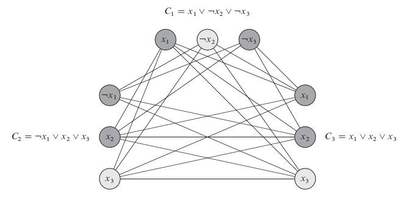

# Problema #3 de DAA

## Título: Kevin el encargado

## Integrantes:

- Diamis Alfonso Pérez
- Abraham González Rivero

# Solución

Nuestro problema se puede modelar como un problema de coloración de grafos, donde cada propuesta de un curso es un vértice del grafo y dos vértices están conectados por una arista si corresponden a dos propuestas que comparten al menos un día en común. Entonces, encontrar k propuestas que no compartan días es equivalente a encontrar un conjunto independiente de k vértices en el grafo.

Para demostrar que la modelación del problema es correcta, debemos demostrar dos cosas:

1. Que para toda solución del problema original (encontrar k propuestas que no compartan días), existe una solución correspondiente en el problema de coloración de grafos (encontrar un conjunto independiente de k vértices).
2. Que para toda solución del problema de coloración de grafos (encontrar un conjunto independiente de k vértices), existe una solución correspondiente en el problema original (encontrar k propuestas que no compartan días).

Para demostrar la primera afirmación, supongamos que tenemos una solución al problema original que consiste en k propuestas que no comparten días entre sí. Podemos construir un grafo no dirigido G de la siguiente manera:

- Cada propuesta corresponde a un vértice de G.
- Dos vértices están conectados por una arista si corresponden a dos propuestas que comparten al menos un día en común.

Es fácil ver que G es un grafo sin aristas entre los vértices seleccionados (es decir, un conjunto independiente) porque cada propuesta seleccionada no comparte días con las otras propuestas seleccionadas. Por lo tanto, G tiene un conjunto independiente de tamaño k, que representa una solución al problema de coloración de grafos correspondiente.

Para demostrar la segunda afirmación, supongamos que tenemos una solución al problema de coloración de grafos que consiste en un conjunto independiente de k vértices en un grafo G. Podemos interpretar cada vértice del conjunto independiente como una propuesta seleccionada que no comparte días con las otras propuestas seleccionadas. Como cada vértice del conjunto independiente no tiene vecinos en G, esto significa que las propuestas correspondientes no comparten días entre sí. Por lo tanto, el conjunto independiente de vértices en G representa una solución al problema original correspondiente.

Por lo tanto, hemos demostrado que existe una correspondencia biunívoca entre las soluciones del problema original y las soluciones del problema de coloración de grafos, lo que demuestra que la modelación del problema como un problema de coloración de grafos es correcta.

Este problema es NP-completo.

Demostremos que hallar un conjunto independiente de tamaño k en un grafo es NP-completo. Debemos demostrar dos cosas:

1. Que el problema pertenece a la clase NP.
2. Que el problema es NP-hard, es decir, que se puede reducir en tiempo polinómico a cualquier otro problema en NP.

Para demostrar que el problema pertenece a la clase NP, debemos demostrar que dada una solución propuesta (es decir, un conjunto de vértices que se cree que forman un conjunto independiente de tamaño k en el grafo), se puede verificar en tiempo polinómico si la solución es válida.

Esto se puede hacer simplemente comprobando que ningún par de vértices en la solución está conectado por una arista en el grafo, lo cual se puede hacer en tiempo O(k^2) si se compara cada par de vértices en la solución.

Para demostrar que el problema es NP-hard, podemos reducir el problema del Clique al problema de hallar un conjunto independiente de tamaño k en un grafo.

El problema del Clique consiste en encontrar un conjunto de vértices en un grafo que formen un clique de tamaño k. Supongamos que tenemos un grafo G y queremos encontrar un clique de tamaño k en G. Podemos construir un grafo G' de la siguiente manera:

- El conjunto de vértices de G' es el mismo que el de G.
- Dos vértices en G' están conectados por una arista si y solo si no están conectados por una arista en G.

Es fácil ver que G' es el grafo complemento de G. Entonces, si encontramos un conjunto independiente de tamaño k en G', este conjunto corresponde a un clique de tamaño k en G.

Por lo tanto, si pudiéramos encontrar un conjunto independiente de tamaño k en tiempo polinómico, también podríamos encontrar un clique de tamaño k en tiempo polinómico, y por lo tanto resolveríamos el problema del Clique en tiempo polinómico. Pero el problema del Clique es NP-completo, por lo que el problema de hallar un conjunto independiente de tamaño k también debe ser NP-hard.

En conclusión, hemos demostrado que el problema de hallar un conjunto independiente de tamaño k en un grafo es NP-completo porque pertenece a la clase NP y se puede reducir en tiempo polinómico a otro problema NP-completo conocido, como el problema del Clique.

## Demostración de Clique como problema NP-Completo

Un clique en un grafo no dirigido $G=(V, E)$ es un subconjunto $V'\subseteq V$ de vértices donde cada uno de ellos está conectado a los otros por una arista en $E$. Es decir, un clique es un subgrafo
completo de $G$. El tamaño de un clique es el número de vértices que contiene. El problema
del clique es el problema de optimización de encontrar un clique de tamaño máximo en un grafo. Como problema de desición, preguntamos si existe un clique de tamaño k en el grafo. La definición formal es:

$CLIQUE = \{ <G, k> :$ si $G$ es un grafo que contiene un clique de tamaño $k$ $\}$

Para demostrar que $CLIQUE \in NP$ debemos demostrar que es posible chequear la correctitud de una solución en tiempo polinomial. Esto lo logramos si comprobamos para cada par de vértices $u, v \in V'$ que la arista $(u, v) \in E$, se hace en $O(|V'|^2)$.

Lo siguiente que probaremos es que $3-CNF-SAT \leq CLIQUE$ para demostrar que el clique es un problema NP-hard.

El algoritmo de reducción comienza con una instancia de $3-CNF-SAT$. Sea $D = C_1 \wedge C_2 \wedge C_3 \wedge ... \wedge C_k$ una fórmula booleana en $3-CNF$ con $k$ cláusulas. Para $r = 1, 2, 3, ..., k $ cada cláusula $C_r$ tiene exactamente tres listerales distintos $l^r_1, l^r_2$ y $l^r_3$. Construiremos un grafo G tal que D sea satisfacible si y solo si $G$ tiene un clique de tamaño $k$.

Construimos el grafo $G=(V, E)$ de la siguiente forma:

Para cada cláusula $C_r = (l^r_1 \lor l^r_2 \lor l^r_3)$ en $D$ colocamos una terna de vértices $v^r_1, v^r_2$ y $v^r_3$ en $V$. Colocamos una arista entre dos vértices $v^r_i$ y $v^s_j$ si cumplen:

1.  $v^r_i$ y $v^s_j$ están en diferentes ternas, es decir, $r \neq s$
2.  sus literales correspondientes son consistentes, es decir, $l^r_i$ no es la negación de $l^s_j$.

Podemos construir el grafo para $D$ en tiempo polinomial. Como un ejemplo de esta construcción tenemos:

$D = (x_1  \lor \urcorner x_2  \lor \urcorner x_3) \land (\urcorner x_1 \lor x_2 \lor x_3) \land (x_1 \lor x_2 \lor x_3)$

Entonces $G$ sería:

Debemos demostrar que esta transformación de $D$ en $G$ es una reducción del problema.

Supongamos que $D$ tiene una asignación satisfacible. Entonces cada cláusula $C_r$ contiene al menos un literal $l^r_i$ que es verdadero, y cada uno de los literales corresponde a un vértice $v^r_i$. Si elegimos un literal verdadero por cada cláusula obtenemos un conjunto $V'$ de $k$ vértices. Podemos decir que $V'$ es un clique. Para dos vértices cualesquiera $v^r_i, v^s_j \in V'$, donde $r \neq s$, sus literales correspondientes $l^r_i, l^s_j$ son verdaderos y esos literales no son complementarios. Por tanto por la construcción de $G$ la arista $(v^r_i, v^s_j) \in E$

En el otro sentido, supongamos que $G$ tiene un clique $V'$ de tamaño $k$. No existen aristas en $G$ que conecten vértices de la misma terna por tanto $V'$ contiene exactamente un vértice por cada terna. Podemos asignar como verdadero a un literal $l^r_i$ correspondiente al vértice $v^r_i \in V'$ sin temor a asignar como verdadero a un literal y su complemento ya que $G$ no tiene aristas entre literales inconsistentes. Cada cláusula está satisfecha y por tanto $D$ está satisfecha.

En el ejemplo de la figura, una asignación válida para D sería $x_2 = 0 $ y $x_3 = 1 $. Un clique correspondiente de tamaño $k = 3 $ consiste en el vértice correspondiente a $\urcorner x_2$ de la primera cláusula, $x_3$ de la segunda cláusula y $x_3$ de la tercera cláusula. Como el clique no contiene a los vétices correspondientes a $x_1$ ni $\urcorner x_1$ podemos asignarle cualquier valor $0$ o $1$.

Note que redujimos una instancia arbitraria de $3-CNF-SAT$ a una instancia de $CLIQUE$ con una estructura específica. Podríamos pensar que solo hemos demostrado que $CLIQUE$ es NP-hard en grafos en los que los vértices están restringidos a ocurrir en ternas y en los que no hay aristas entre los vértices en la misma terna. De hecho, hemos demostrado que $CLIQUE$ es NP-hard solo en este caso restringido, pero esta prueba es suficiente para demostrar que $CLIQUE$ es NP-hard en grafos generales. Porque si tuviéramos un algoritmo de tiempo polinomial que resolviera
$CLIQUE$ en grafos generales, también resolvería $CLIQUE$ en grafos restringidos.

La aproximación contaria, reducir instancias de $3-CNF-SAT$ con una estructura particular a instancias arbitrarias de $CLIQUE$ no es suficiente porque podríamos haber escogido instancias fáciles de $3-CNF-SAT$, por lo que no habríamos reducido un problema NP-hard a $CLIQUE$.

## Primera Solución. Fuerza Bruta.

### Pseudocódigo:

    def KProposals(k, dates, checkdates, taken):
        if len(taken) == k:
            return taken
        for i in range(len(dates)):
            if Fit(dates[i], taken) and not checkdates[i]:
                newTaken = taken.copy()
                newTaken.append(dates[i])
                checkdates[i] = True
                newcheck = checkdates.copy()
                return KProposals(k, dates, newcheck, newTaken)

        oldcheck = checkdates.copy()
        return KProposals(k, dates, oldcheck, taken[:len(taken) - 1])

    def Fit(item, itemlist):
        for prop in itemlist:
            for i in item:
                for j in prop:
                    if i == j:
                        return False

        return True

Una primera solución pudiera ser intentar ir construyendo todos los subconjuntos de tamaño K mientras se comprueba si estos son válidos. Evidentemente si existe la solución, el algoritmo la hallará pues explora todos los subconjuntos de tamaño k posibles.  
 Luego la complejidad temporal del algoritmo es $O(k^2p^2$ $ {N}\choose{k}$ $)$ donde $p$ es el tamaño de la mayor propuesta de la entrada.

## Modelación y nuestro algoritmo de aproximación:

El algoritmo que modela nuestro problema a un grafo se encuentra en el fichero "BuildGraph.py" donde nos apoyamos de la biblioteca de python NetworkX para el trabajo con grafos. Se modela siguiendo las condiciones descritas al inicio del informe, se coloca la arista <u,v> si la intersección entre las propuestas u y v no es vacía. Como debemos comparar cada propuesta con el resto de las propuestas para conocer su intersección la complejidad de modelar el grafo es $O(n^2p^2)$ donde $p$ es la mayor propuesta enviada.

### Algoritmo de aproximación propuesto:

### Pseudocódigo:

    def WeightedVertex(items,k):
        G = buildGraph(items)
        for node in G.nodes():
            G.nodes[node]['weight'] = 2 ** (-G.degree(nodes))
        mis = set()
        while G:
            node = max(G.nodes(), key=lambda x: G.nodes[x]['weight'])
            cover.add(node)
            for neighbor in G.neighbors(node):
                G.nodes[neighbor]['weight'] = 0
             G.remove_node(node)

        if len(mis) >=k : return mis[:k]
        else: return mis

Tras modelar el grafo el algoritmo le asigna a cada vértice como peso $2^{-deg(v)}$. Luego ordena los vértice por peso y va añadiendo al conjunto independiente los vértices de mayor peso que no son vecinos entre ellos. Nuestro algoritmo utiliza como heurística la idea de que los vértices de menor grado tienen una mayor probabilidad de pertenecer al mayor conjunto independiente, entonces tiene sentido que aquellos vértices de menor grado que no sean vecinos entre ellos pertenezcan al mayor conjunto independiente.
Debido a que al costo de la modelación, la complejidad temporal de nuestro algoritmo es $O(n^2p^2)$
